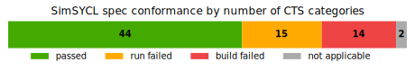

<p align="center">

<br/>
<i>“Technically correct is the best kind of correct”</i><br/>&nbsp;
</p>

SimSYCL is a single-threaded, synchronous, library-only implementation of the SYCL 2020 specification. It enables you to test your SYCL applications against simulated hardware of different characteristics and discover bugs with its extensive verification capabilities.

## Implementation progress

SimSYCL is still under development, but it already passes a large portion of the [SYCL Conformance Test Suite](https://github.com/KhronosGroup/SYCL-CTS):



## Requirements

SimSYCL requires CMake, a C++20 compiler and the Boost `context` libary to be installed.

## Supported Platforms

The following platform and compiler combinations are currently tested in CI:

 * Linux with GCC 11
 * Linux with Clang 17
 * Windows with MSVC 14
 * MacOS with GCC 13

Other platforms and compilers should also work, as long as they have sufficient C++20 support.
Note that Clang versions prior to 17 do not currently work due to their incomplete CTAD support.

## Installing SimSYCL

To build SimSYCL and install it next to the source directory, run e.g.:

```sh
cmake -B build -DCMAKE_BUILD_TYPE=Debug -DCMAKE_INSTALL_PREFIX=$(pwd)-install
cmake --build build --target install
```

### Build Options

These can be set on the CMake command line via `-DOPTION=VALUE`.

| option | values | effect |
|---|---|---|
| `SIMSYCL_ANNOTATE_SYCL_DEPRECATIONS` | `OFF`,`ON` | Mark deprecated SYCL APIs with `[[deprecated]]` (default `ON`) |
| `SIMSYCL_ENABLE_ASAN`| `OFF`,`ON` | Build SimSYCL and the user code with AddressSanitizer (default `OFF`) |
| `SIMSYCL_CHECK_MODE` | `NONE`,`LOG`,`THROW`,`ABORT` | How to report verification errors (default `ABORT`) |

## Using SimSYCL

To get started, simply copy the `examples` folder to a separate location and edit its files as you see fit. To build against SimSYCL installed as above:

```sh
cmake -B build -DCMAKE_BUILD_TYPE=Debug -DCMAKE_PREFIX_PATH=/path/where/you/installed/SimSYCL
cmake --build build
```

### Environment Variables

These are available to all SimSYCL applications.

| variable | values | effect |
|---|---|---|
| `SIMSYCL_SYSTEM` | `system.json` | Simulate the system defined in `system.json` |
| `SIMSYCL_SCHEDULE` | `rr`, `shuffle`, `shuffle:<seed>` | Choose a schedule for work item order in kernels |

### System Definition Files

Systems are defined by listing all devices, platforms and their runtime properties in a JSON file.
As a starting point, you can export the built-in system definition via
```c++
simsycl::write_system_config("system.json", simsycl::builtin_system);
```
and then use your (modified) system definition via
```sh
SIMSYCL_SYSTEM=system.json build/matmul
```

## Research

For a detailed introduction and evaluation of SimSYCL, please refer to the [the IWOCL'24 paper](https://dl.acm.org/doi/pdf/10.1145/3648115.3648136).

If you're using SimSYCL as part of your own research, we kindly ask you to cite it as:
```bibtex
@inproceedings{simsycl,
  title={{SimSYCL}: A {SYCL} Implementation Targeting Development, Debugging, Simulation and Conformance},
  author={Thoman, Peter and Knorr, Fabian and Crisci, Luigi},
  booktitle={Proceedings of the 12th International Workshop on {OpenCL} and {SYCL}},
  pages={1--12},
  year={2024}
}
```
